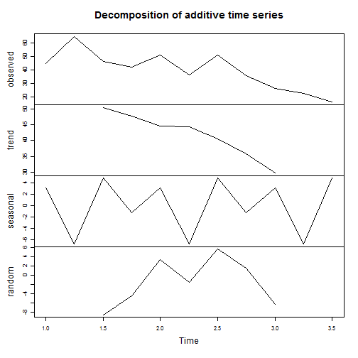
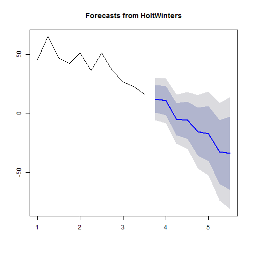

Time Series Forecasting Shiny App Presentation
========================================================
author: Mahbub khan
date: 

Overview
========================================================
### This is a Financial Time Series Forecasting App.
### Financial Data is loaded from Google using quantmod R package.
### Twitter, Facebook & Apple time series available at the moment.
### Users can select start and end date of the data.
### Users can also select time frame, monthly & quarterly available at present.
### Clicking "Update view" button will show outputs in three tabs:
* Time Series tab will display the interactive time series
* Decomposition tab will display the time series decomposed into trend and seasonality
* Forecast tab will display the Forecast.
* There's also a help tab, holding supporting documentation

Time Series Interactive Visualisation
========================================================

[1] "TWTR"
<!-- LineChart generated in R 3.2.5 by googleVis 0.5.10 package -->
<!-- Tue Jun 21 12:12:26 2016 -->

<!-- jsHeader -->

 
<!-- jsChart -->  

 
<!-- divChart -->
  

Time Series Decomposition
========================================================

Time Series Forecasting
========================================================

